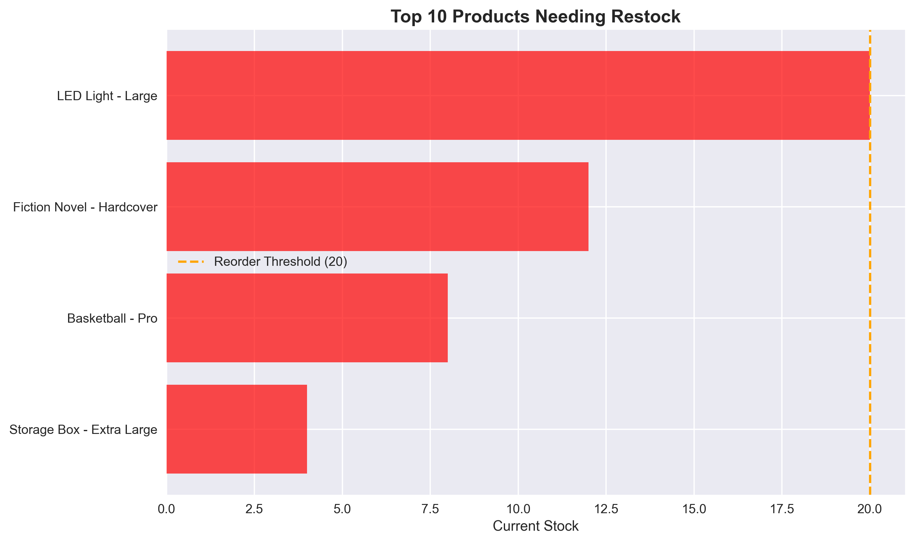

# Smart Inventory Management & Analysis Tool

A comprehensive Python solution for automating inventory tracking, analysis, and reporting. This portfolio sample demonstrates advanced data processing, business intelligence, and automation capabilities for small to medium-sized businesses.

**[View Live Demo](#usage)** | **[See Sample Reports](#features)**

## 🎯 Business Applications

| Industry                | Use Case                                                                    | Key Benefits                                                       |
| ----------------------- | --------------------------------------------------------------------------- | ------------------------------------------------------------------ |
| **Retail Stores**       | Track product inventory, identify bestsellers, automate reorder alerts      | Prevent stockouts, optimize purchasing, reduce manual tracking     |
| **E-commerce**          | Monitor SKU performance, analyze category trends, generate supplier reports | Data-driven inventory decisions, automated low-stock notifications |
| **Restaurants**         | Manage ingredient inventory, track usage patterns, control food costs       | Reduce waste, ensure availability, streamline operations           |
| **Warehouses**          | Oversee multi-category inventory, generate performance analytics            | Improve efficiency, optimize storage, automate reporting           |
| **Small Manufacturing** | Track raw materials, monitor component levels, plan procurement             | Prevent production delays, optimize cash flow                      |

## ✨ Features

### 📊 Automated Analysis

- **Low Stock Detection** - Customizable threshold alerts with urgency levels (Critical/Low)
- **Category Performance** - Comprehensive breakdown by product categories
- **Inventory Valuation** - Real-time calculation of total inventory worth
- **Reorder Calculations** - Automated suggestions with cost estimates

### 📈 Professional Reporting

- **Visual Charts** - Category analysis, stock level distributions, restock priorities
- **CSV Exports** - Clean, formatted reports for business use
- **Executive Summaries** - Key metrics and actionable insights
- **Customizable Thresholds** - Adapt alerts to your business needs

### 🔧 Technical Capabilities

- **Flexible Data Input** - Supports CSV files or generates sample data for testing
- **Data Validation** - Automatic cleaning and error handling
- **Scalable Architecture** - Object-oriented design for easy customization
- **Professional Output** - Business-ready charts and reports

## 🚀 Quick Start

### Prerequisites

```bash
pip install pandas matplotlib seaborn numpy
```

### Usage

```bash
# Clone and run
git clone https://github.com/yourusername/python-inventory-manager
cd python-inventory-manager
python inventory_manager.py

# Choose demo mode:
# 1. Full Business Analysis (recommended)
# 2. Individual Feature Demo
```

### Input Data Format

Your CSV file should include these columns (examples shown):

```csv
Product Name,Category,Current Stock,Price,Supplier,Last Updated
Wireless Headphones,Electronics,45,99.99,ABC_Electronics,2024-01-15
Cotton T-Shirt,Clothing,12,24.99,Fashion_Depot,2024-01-15
Garden Tools,Home & Garden,8,45.00,Tool_Supply_Co,2024-01-15
```

**Required columns:** Product Name, Category, Current Stock, Price  
**Optional columns:** Supplier, Last Updated  
_Note: Product names and suppliers shown are examples only_

## 📋 Sample Output

### Console Analysis

```
🚨 LOW STOCK ALERT - 6 products need attention:
🔴 CRITICAL Basketball - Pro
   Stock: 2 | Value: $16.06
   Category: Sports

💰 REORDER ANALYSIS:
Items needing reorder: 14
Total reorder investment: $2,847.23
Average cost per item: $203.37
```

### Generated Files

- **Visual Reports:** `inventory_reports/category_analysis.png`, `low_stock_alert.png`
- **Reorder Report:** `reorder_report.csv` with suggested quantities and costs
- **Sample Data:** `sample_inventory.csv` for testing (auto-generated if no file provided)

### Sample Chart Output


_Category breakdown showing stock levels and inventory value distribution_


_Visual identification of products requiring immediate restocking_

## 🛠️ Customization Options

### Adjust Alert Thresholds

```python
manager = InventoryManager()
manager.low_stock_threshold = 25  # Set custom threshold
```

### Custom Analysis

```python
# Individual method calls for specific insights
low_stock = manager.analyze_low_stock()
category_stats = manager.category_analysis()
manager.create_visual_reports()
```

## 💼 Professional Services

This tool demonstrates capabilities in:

- **Data Processing & Analytics** - Clean, validate, and analyze business data
- **Workflow Automation** - Replace manual inventory tracking with automated systems
- **Business Intelligence** - Transform raw data into actionable insights
- **Custom Reporting** - Generate executive-ready visualizations and summaries

### Implementation Process

1. **Requirements Analysis** - Understand your current inventory workflow
2. **Data Integration** - Connect with your existing systems (POS, ERP, spreadsheets)
3. **Custom Development** - Adapt features to your specific business needs
4. **Training & Support** - Ensure your team can maximize the tool's value

### Contact Information

**Nevin Kadlec** - Full-Stack Developer

- [Email Me](mailto:3rza.kaneki@gmail.com)
- [LinkedIn](https://www.linkedin.com/in/nevin-kadlec/)
<!--- [Portfolio Projects](TODO)-->

_Specializing in business automation, web applications, and productivity solutions_

## 🔧 Technical Details

**Built With:**

- Python 3.8+
- Pandas for data processing
- Matplotlib & Seaborn for visualizations
- NumPy for calculations

**Architecture:**

- Object-oriented design for maintainability
- Modular methods for flexibility
- Error handling and data validation
- Professional coding standards

## 📄 License

This project is licensed under the MIT License - see the [LICENSE](LICENSE) file for details.

---

_This is a portfolio demonstration showcasing Python automation and business intelligence capabilities. The tool generates realistic sample data for demonstration purposes._
